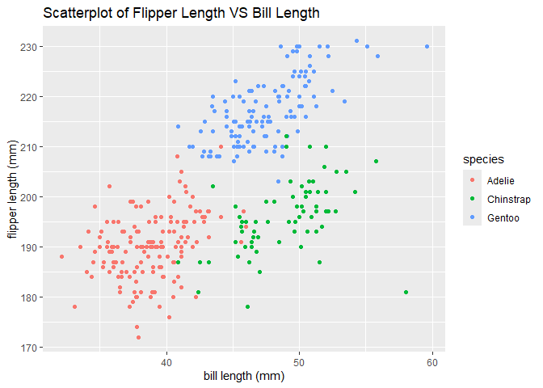

p8105_hw1_yf2735
================
Yujing FU
2024-09-18

## problem 1

``` r
data("penguins", package = "palmerpenguins")
```

The data in this dataset is showed as follows:

``` r
penguins
```

    ## # A tibble: 344 × 8
    ##    species island    bill_length_mm bill_depth_mm flipper_length_mm body_mass_g
    ##    <fct>   <fct>              <dbl>         <dbl>             <int>       <int>
    ##  1 Adelie  Torgersen           39.1          18.7               181        3750
    ##  2 Adelie  Torgersen           39.5          17.4               186        3800
    ##  3 Adelie  Torgersen           40.3          18                 195        3250
    ##  4 Adelie  Torgersen           NA            NA                  NA          NA
    ##  5 Adelie  Torgersen           36.7          19.3               193        3450
    ##  6 Adelie  Torgersen           39.3          20.6               190        3650
    ##  7 Adelie  Torgersen           38.9          17.8               181        3625
    ##  8 Adelie  Torgersen           39.2          19.6               195        4675
    ##  9 Adelie  Torgersen           34.1          18.1               193        3475
    ## 10 Adelie  Torgersen           42            20.2               190        4250
    ## # ℹ 334 more rows
    ## # ℹ 2 more variables: sex <fct>, year <int>

The dataset has 344 rows and 8 columns.

``` r
print(paste("row =", nrow(penguins)))
```

    ## [1] "row = 344"

``` r
print(paste("col =", ncol(penguins)))
```

    ## [1] "col = 8"

The mean of the flipper length is around 200 mm

``` r
print(paste("mean_flipper_length =", mean(penguins$flipper_length_mm, na.rm = TRUE)))
```

    ## [1] "mean_flipper_length = 200.915204678363"

The scatterplot of flipper_length_mm (y) vs bill_length_mm (x):

``` r
penguins_clean <- na.omit(penguins)
ggplot(data=penguins, aes(x = bill_length_mm, y = flipper_length_mm, color = species)) +
  geom_point() +
  labs(title = "Scatterplot of Flipper Length VS Bill Length",
       x = "bill length (mm)",
       y = "flipper length (mm)")
```

    ## Warning: Removed 2 rows containing missing values or values outside the scale range
    ## (`geom_point()`).

<!-- -->

``` r
ggsave("scatterplot_flipper_vs_bill_length.png")
```

    ## Saving 7 x 5 in image

    ## Warning: Removed 2 rows containing missing values or values outside the scale range
    ## (`geom_point()`).

## problem 2

``` r
set.seed(111)
hw1_df = tibble(
  vec_numeric = rnorm(10, mean = 0, sd = 1),
  vec_logical = vec_numeric > 0,
  vec_char = letters[1:10],  
  vec_factor = factor(rep(1:3, length.out = 10), labels = c("level 1", "level 2", "level 3"))
)
hw1_df
```

    ## # A tibble: 10 × 4
    ##    vec_numeric vec_logical vec_char vec_factor
    ##          <dbl> <lgl>       <chr>    <fct>     
    ##  1       0.235 TRUE        a        level 1   
    ##  2      -0.331 FALSE       b        level 2   
    ##  3      -0.312 FALSE       c        level 3   
    ##  4      -2.30  FALSE       d        level 1   
    ##  5      -0.171 FALSE       e        level 2   
    ##  6       0.140 TRUE        f        level 3   
    ##  7      -1.50  FALSE       g        level 1   
    ##  8      -1.01  FALSE       h        level 2   
    ##  9      -0.948 FALSE       i        level 3   
    ## 10      -0.494 FALSE       j        level 1

To compute their means:

``` r
set.seed(111)
mean(pull(hw1_df, vec_numeric))  
```

    ## [1] -0.6690135

``` r
mean(pull(hw1_df, vec_logical))  
```

    ## [1] 0.2

``` r
mean(pull(hw1_df, vec_char))
```

    ## Warning in mean.default(pull(hw1_df, vec_char)): argument is not numeric or
    ## logical: returning NA

    ## [1] NA

``` r
mean(pull(hw1_df, vec_factor))   
```

    ## Warning in mean.default(pull(hw1_df, vec_factor)): argument is not numeric or
    ## logical: returning NA

    ## [1] NA

Summarize:

1)  numerical caribles can work

2)  logical varibles will be automatically transferred to 0 or 1,
    therefore the mean can be computed

3)  character variables can’t work because we can’t take the mean of
    some characters

4)  factor variables can’t work because they can’t be averaged directly

To convert variables from one type to another:

``` r
as.numeric(pull(hw1_df, vec_logical))
as.numeric(pull(hw1_df, vec_char))
```

    ## Warning: NAs introduced by coercion

``` r
as.numeric(pull(hw1_df, vec_factor))
```
